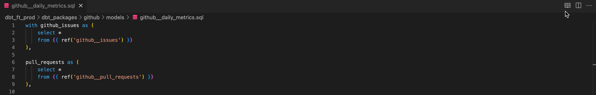
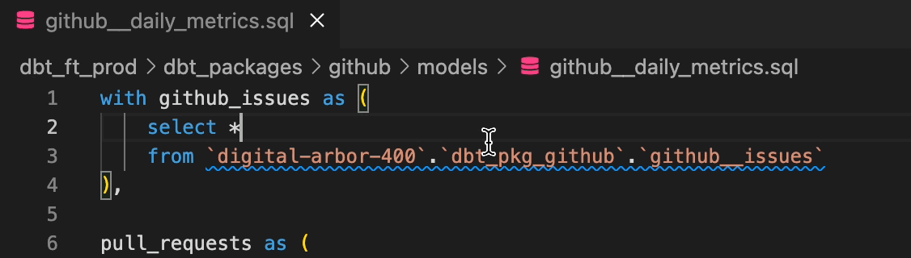
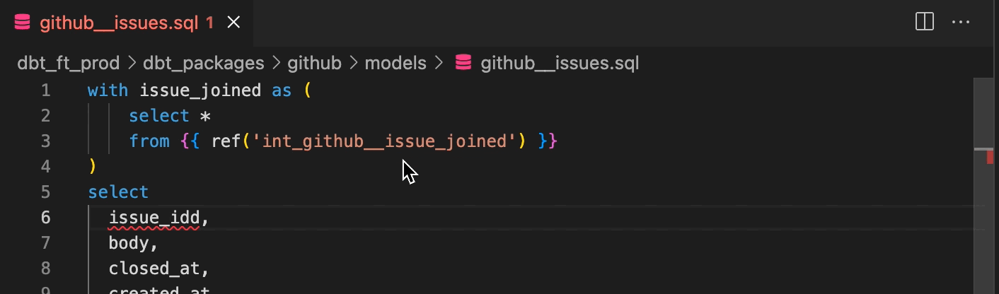
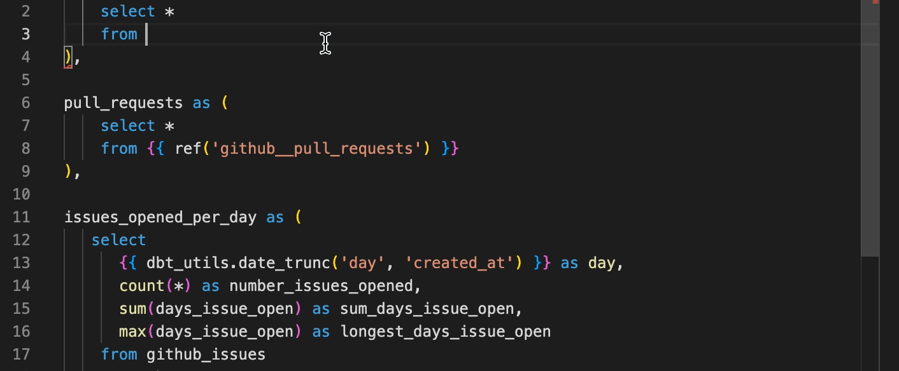
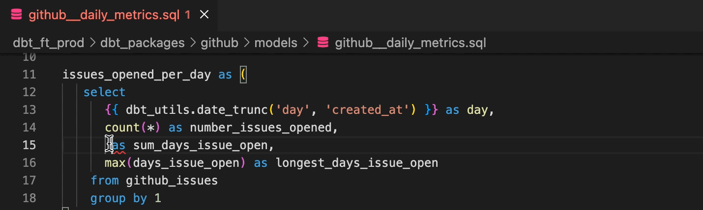
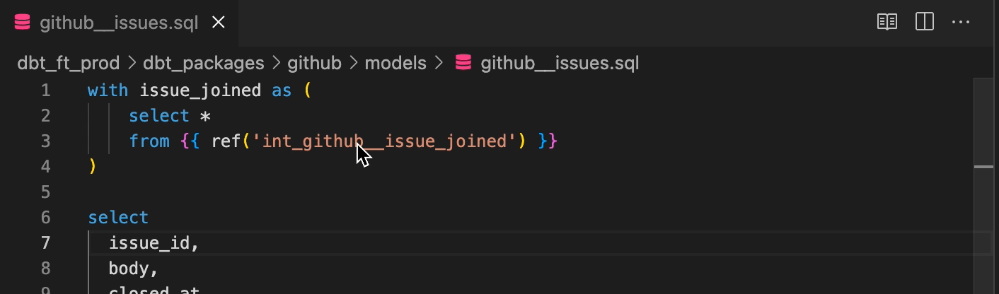

# dbt Wizard

Working with [dbt Core](https://www.getdbt.com/) in Visual Studio Code using the Fivetran dbt Wizard extension accelerates your first-time environment setup with dbt Core, and optimizes your continual development of transformation pipelines. This extension is designed primarily for BigQuery destinations, but support for other warehouses is in development.

Note: Turning on [Auto Save](https://code.visualstudio.com/docs/editor/codebasics#_save-auto-save) is strongly recommended. This feature enables near real-time query preview, auto-completion, and error highlighting with dbt Wizard.

### Table of Contents

- [Features](#features)
  - [Query preview](#query-preview)
  - [SQL to ref conversion](#sql-to-ref-conversion)
  - [Error highlighting (BQ only)](#error-highlighting)
  - [Auto-completion of columns, tables, and refs (BQ only)](#auto-completion-of-columns-tables-and-refs)
  - [Function signature help (BQ only)](#function-signature-help)
  - [Go to Definition](#go-to-definition)
- [How to get set up](#how-to-get-set-up)
- [Issues](#issues)

## Features

Note: error highlighting, auto-completion, and function signature help are only available for BigQuery.

### Query preview

There are two ways to display a compiled query preview.

1. Click the Preview icon in the top right corner of your tab
1. Right click > dbt Wizard > Show preview

Both methods open the compiled query in a new tab.

### SQL to ref conversion

If a hardcoded table name can be converted to a dbt ref, the extension can convert that SQL for you automatically, by clicking on the lightbulb icon to the left of the line.

### Error highlighting

Hover over misspelled column and table names to see suggested fixes. SQL syntax errors are also highlighted for your review.

### Auto-completion of columns, tables, and refs

#### Macros, models and sources

### Function signature help

Hover over SQL functions to see their definitions and required parameters.

### Go to Definition

#### Macros, models and sources

If you press `Cmd` and hover over a macro, model, or source name, a preview of the declaration will appear.
You can jump to the definition with `Cmd+Click` or open the definition to the side with `Cmd+Alt+Click`.

### How to get set up

The extension works on MacOS, Linux, and Windows (for Windows, see the additional steps in the [Windows Support](docs/WindowsSupport.md) article). It supports the default locations for `profiles.yml` and `dbt_project.yml` files.

Prior to using the extension, you need to perform the following steps in the VS Code Terminal:

1. [Install your dbt Core adapter and dbt-rpc](https://docs.getdbt.com/dbt-cli/install/overview).
    - `python3 -m pip install dbt-bigquery dbt-rpc`
1. Test that dbt-rpc works
    - `dbt-rpc --version`
1. Create your [dbt profile](https://docs.getdbt.com/dbt-cli/configure-your-profile) and add your credentials.
    - `touch ~/.dbt/profiles.yml`
    - See dbt Labs’ [BigQuery profile](https://docs.getdbt.com/reference/warehouse-profiles/bigquery-profile) documentation for more guidance on how to populate this file.
1. Open your dbt project in a new VS Code window.
1. Check that the extension is operating by right-clicking in any .sql model file, and selecting `dbt Wizard > Show query preview`.

### Issues

If you have found any bug, have an idea or suggestion on how to improve extension, please file an issue and provide the details here: [Issues](https://github.com/fivetran/dbt-language-server/issues)
